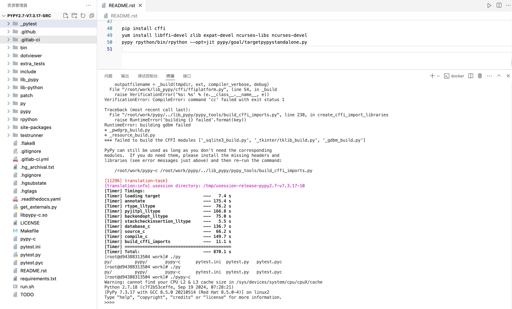

# pypy-code-ecrypt-patch
recompile pypy engine for code ecrypt deploy，修改并重新编译pypy引擎源码，以便对代码进行加密部署，可以根据需要针对不同平台进行编译，本项目提供了差异化修改思路，可以参考修改任何pypy引擎版本。
pypy引擎源码：https://downloads.python.org/pypy/pypy2.7-v7.3.17-src.tar.bz2

